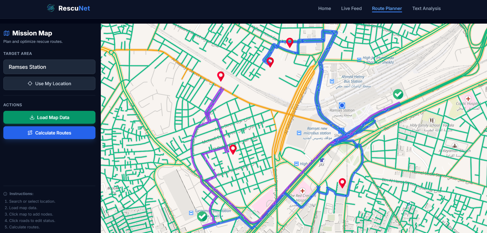
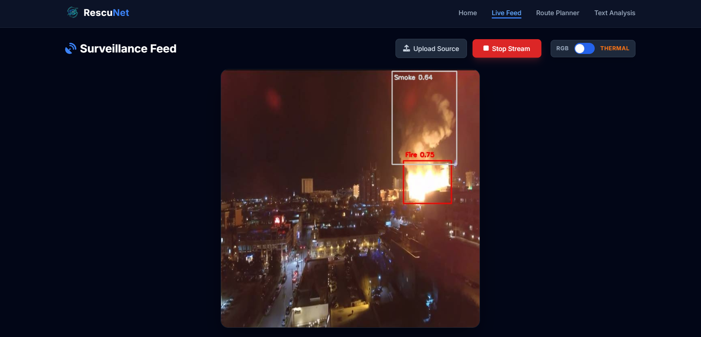
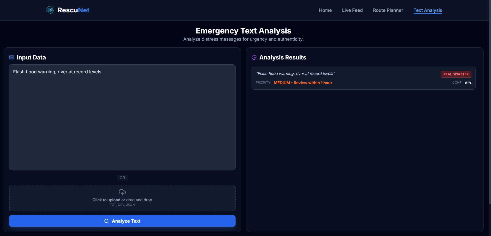

# RescuNet

<div align="center" style="padding: 0; margin: 0; top: 0;">
  
  <p><b>Next-Gen Disaster Response Intelligence</b></p>
  <p>
    <a href="#key-features">Key Features</a> •
    <a href="#tech-stack">Tech Stack</a> •
    <a href="#installation">Installation</a> •
    <a href="#usage">Usage</a> •
    <a href="#license">License</a>
  </p>
</div>

---

RescuNet is a comprehensive platform designed to revolutionize emergency response operations. By integrating AI-powered aerial surveillance, advanced graph-based routing, and real-time text analysis, RescuNet empowers responders to locate survivors, identify hazards, and navigate complex disaster zones with unprecedented efficiency.

## Key Features

### 🗺️ Graph Routing
- **Smart Pathfinding**: Leverages **Graph Neural Networks (GNN)** to predict edge safety and travel costs dynamically.
- **Hybrid Solver**: Features a high-performance **C++ Routing Engine** with a robust Python fallback to calculate optimal rescue paths.
- **Interactive Map**: Plan missions, manage nodes, and visualize routes using **MapLibre GL JS**.

<div align="center" style="padding: 0; margin: 0; top: 0;">
  
  <br>
  <i>Interactive Mission Planning Map</i>
</div>

### 🚁 Aerial Intelligence
- **Real-Time Detection**: Utilizes **YOLOv11** to detect survivors, fire, and smoke hazards instantly from drone video feeds.
- **Dual-Mode Surveillance**: Supports both **Thermal** (Person Detection) and **RGB** (Fire & Smoke Detection) modes.
  - **Fire**: Detected with **Red** bounding boxes.
  - **Smoke**: Detected with **Gray** bounding boxes.
- **Low-Latency Streaming**: WebSocket-based architecture ensures real-time video transmission and processing.

<div align="center" style="padding: 0; margin: 0; top: 0;">
  
  <br>
  <i>Live Drone Feed with Object Detection</i>
</div>

### 💬 Text Analysis
- **Intelligent Classification**: Uses an **LSTM** model to distinguish between **Real Disasters** and **Fake/Absurd** reports.
- **Priority Scoring**: Automatically assigns priority levels (**High**, **Medium**, **Low**) based on the model's confidence score.
- **Batch Processing**: Supports analyzing multiple reports simultaneously from uploaded files (`.txt`, `.csv`, `.json`).

<div align="center" style="padding: 0; margin: 0; top: 0;">
  
  <br>
  <i>Emergency Text Classification Interface</i>
</div>

## Tech Stack

- **Backend**: FastAPI, Python 3.9
- **Core Logic**: C++, PyBind11, OSMNx, NetworkX
- **AI / ML**: PyTorch, PyTorch Geometric, Ultralytics YOLO
- **Frontend**: React 19, Vite, TailwindCSS, MapLibre GL JS
- **Dependency Management**: Pipenv

## Installation

### Prerequisites
- Python 3.9 or higher
- Pipenv (`pip install pipenv`)
- C++ Compiler (GCC/Clang/MSVC) for the routing engine

### 1. Backend Setup

Navigate to the backend directory and install dependencies:

```bash
cd backend
pipenv install
pipenv shell
```

### 2. Build C++ Routing Engine

Compile the high-performance C++ solver extension:

```bash
cd cpp_router
pip install .
cd ..
```

### 3. Frontend Setup

Navigate to the frontend directory and install dependencies:

```bash
cd frontend
npm install
```

## Usage

### Start the Backend Server
Run the following command from within the `backend` directory (ensure your virtual environment is active):

```bash
uvicorn app.main:app --reload --host 0.0.0.0 --port 8000
```

The API will be available at `http://localhost:8000`.
- **API Documentation**: `http://localhost:8000/docs`
- **Health Check**: `http://localhost:8000/api/health`

### Launch the Frontend
Run the development server:

```bash
cd frontend
npm run dev
```

Open the URL shown in the terminal (usually `http://localhost:5173`).

## Project Structure

```
RescuNet/
├── assets/                    # Project screenshots and logos
├── backend/                   # FastAPI application
│   ├── app/                   # Main application logic and endpoints
│   ├── models/                # GNN and YOLO model definitions
│   ├── router/                # Routing logic (Python & C++)
│   ├── docs/                  # Backend documentation
│   └── Pipfile                # Python dependencies
├── frontend/                  # React Application
│   ├── public/                # Static assets
│   ├── src/                   # Source code
│   │   ├── components/        # Reusable UI components
│   │   ├── pages/             # Route pages (LiveFeed, RoutePlanner, etc.)
│   │   ├── App.jsx            # Main app component
│   │   └── main.jsx           # Entry point
│   ├── index.html             # HTML entry point
│   ├── package.json           # Dependencies
│   └── vite.config.js         # Vite configuration
├── LICENSE                    # Project license file
└── README.md                  # Project documentation
```

## Authors

| Name            | Role                                      |
|-----------------|-------------------------------------------|
| [Youssef Elebiary](https://github.com/YoussefElebiary)| Graph Routing Engine (GNN & C++) & Fullstack Development |
| [Mohamed Maher](https://github.com/Maherr11)   | Object Detection AI Models                |
| [Amr Hassan](https://github.com/amr1372003)      | Object Detection AI Models                |
| [Ahmed Ghazaly](https://github.com/ghazaly118) | Text Analysis ML Models                   |
| [Akram Tarek](https://github.com/Akramz1)     | Text Analysis ML Models                   |

## License

This project is licensed under the MIT License - see the [LICENSE](LICENSE) file for details.

## Acknowledgments

- **Ultralytics** for the YOLO models.
- **OSMNx** for simplifying OpenStreetMap graph retrieval.
- **MapLibre** for the open-source mapping library.
