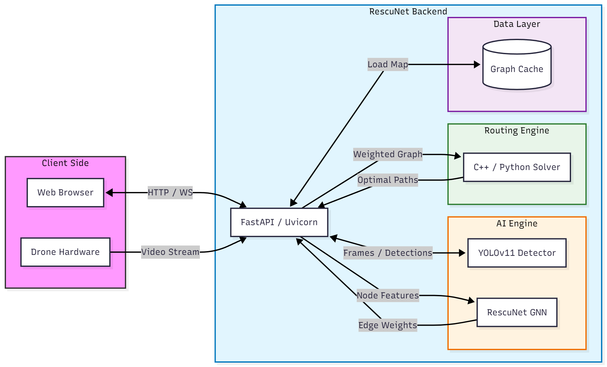

# RescuNet Backend Documentation

Welcome to the technical documentation for the RescuNet backend. This directory contains detailed information about the system's architecture, API endpoints, AI models, and routing engine.

## Table of Contents

1.  [**API Reference**](./api_reference.md)
    - Detailed documentation of all HTTP and WebSocket endpoints.
    - Request/Response schemas and data models.

2.  [**AI & Machine Learning Models**](./ai_models.md)
    - **RescuNet GNN**: Graph Neural Network for dynamic edge cost prediction.
    - **YOLOv11**: Object detection for survivors and fire/smoke.
        - **Fire**: Visualized with Red bounding boxes.
        - **Smoke**: Visualized with Gray bounding boxes.

3.  [**Routing Engine**](./routing_engine.md)
    - **C++ Solver**: High-performance multi-vehicle routing algorithm.
    - **Python Fallback**: Robust fallback routing logic.
    - **Algorithm Details**: Dijkstra's algorithm and greedy survivor assignment.

## Architecture Overview

The RescuNet backend is built using **FastAPI**, designed for high performance and easy concurrency. It integrates several key components:

-   **Web Server**: Uvicorn/FastAPI handling HTTP requests and WebSockets.
-   **Computer Vision**: Ultralytics YOLO models running on a separate thread to process video feeds.
-   **Graph Processing**: NetworkX for graph manipulation and PyTorch Geometric for GNN inference.
-   **Routing Core**: A custom C++ extension (bound via PyBind11) for rapid pathfinding, with a Python equivalent for compatibility.

  
   
  <i>System Architecture Diagram</i>

## Directory Structure

-   `app/`: Main application logic (`main.py`), utilities, and caching.
-   `models/`: PyTorch model definitions and weights.
-   `router/`: C++ source code and Python wrapper for the routing engine.
